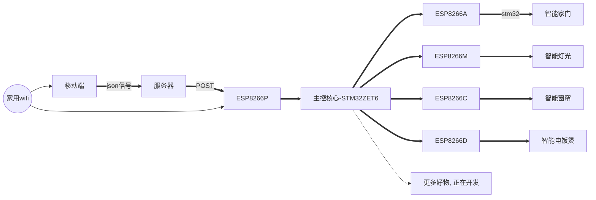

# from **differencial equation** to **difference equation**

$$\begin{aligned}\text{d}y+y\cdot\text{d}x=0\\f(\frac{k}{n})-f(\frac{k-1}{n})+f(\frac{k-1}{n})\cdot\frac{1}{n}=0\end{aligned}$$

Besides, $y=f(x)$, $n\to\infin$, $k=2,3,\dots,n$.

