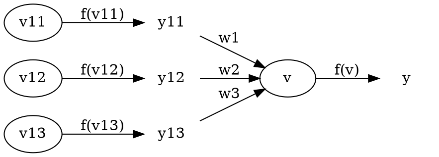

* TOC
{:toc}

There are ample and thus enough 

# deep learning revealed: optimization and neural network

Take a review of [*Neural Network and Deep Learning*](http://neuralnetworksanddeeplearning.com/) by **Michael Nielsen** or other affected texts upon deep learning and  generate the very initial and essential of neural network: 

$$\{\mathrm{W}^{(k)}\}=\arg \min L(d_i,y_i)$$

The notes $k$ and $i$ remark the number and order of layers, labels and outputs. You may find $d$ and $y$ another marks as $y$ and $\hat{y}$ in most other text aimed at the expression of expected \`$y$' and factually calculated \`$\hat{y}$'. Yet here we deploy the former tuple in order not to drive outselves into confusions.

<!-- <div class=mermaid align=center>
graph LR
id11(("$y^{(-1)}_1$"))--"$y^{(-1)}_1w_1$"---id2(("$v$"))
id12(("$y^{(-1)}_2$"))--"$y^{(-1)}_2w_2$"---id2
id13(("$y^{(-1)}_3$"))--"$y^{(-1)}_3w_3$"---id2
id2--"$\varphi(v)$"---id3(("y"))
style id3 fill:#fff,stroke:#fff
</div> -->



All before the reasoning of the so-called $\mathrm W^{(k)}$ shall be a quick look at how the neural network works. The diagram above displays a simplified forward and backward propagation prograss amid a whole neural network. As for a full connection neural network, each neuron is calculated by all the neurons multiplied with a certain weight in the prvious layer, as the following expression states:

$$v_i=\sum_j w_jy^{(-1)}_j$$

To store all the weight for every neurons in the present  layer  to be calculated by the output from the previous layer, a weight matrix is quite welcomed. With each row stores the weights (say) to be multiplied with the output from the previous layer(or colume according to your habit, on condition. Yet to store them in row is actually a common way), the weight matrix could be written as 

$$\mathrm{W}_{M\times n}=
\begin{bmatrix}
w_{1,1} & \cdots & w_{1,n} \\
\vdots & \ddots  & \vdots \\
w_{M,1} & \cdots & w_{M,n}
\end{bmatrix}$$

Obviously the footnotes $M$ and $n$ represent the numbers of neurons in the **present** and **previous** layer. It helps to process the following simplified calculation with a better understanding of how the output from the previous layer comes to be the neurons (say) in the present layer.

$$\mathrm{v}_M=\mathrm{W}_{M\times n}\mathrm{y}^{-}_{n}$$

So far shall ya be enlighted how the problems upon neural network essentially lise optimization problems in a mathematical space. The values passed from layer to layer somehow could be viewed as a vector in its vector space traveling through **linear mapping**. The progress of learning *or* updating the weight matrix is to search the optimal or suboptimal point in the vector space represented by the neural network.

> It is recommended to take a view back to the first optimization expression and attemp to figure out some relations.

# a quick review

In this section, it costs a few minutes to review some most common used functions or strategies, which lies 

- three  activation function: 
- - sigmoid function(*or*, logistic function)
- - Recitified Unit Linear function(*in short*, ReLU function) 
- - softmax function

- two loss function(*or*, cost function):
- - variance loss function
- - cross entropy function

- two learning approach (say, *or*, optimization strategy *or* updating strategy) with backpropagation approach:
- - stochastic gradient descent(*in short*, SGD)
- - batch gradient descent(*or*, mini batch gradient descent)

- three fields of convolving 2-dimensional signals:
- - full field
- - same field
- - valid field

- two pooling strategy:
- - average pooling
- - max pooling

- one signal processing strategy for handling vanishing gradient:
- - dropout

## activation functions with their gradients

### sigmoid function(*or*, logistic function)

- defination: $\displaystyle{\frac{1}{1+\exp(-x)}}$
- gradient: \
with $y$ as the activated neural nodes from $v$ for output of the present layer, the gradient lies: 
$\displaystyle{\frac{\partial y}{\partial v}=y\cdot(1-y)}$

> The python module `scipy` provides a pre-defined sigmoid function.

```python
from scipy.special import expit
```

> It cost not so apparent 

### Recitified Unit Linear function(*in short*, ReLU function) 

- defination: $\displaystyle{y=\begin{cases}v &, v>0\\ 0 &,v\leqslant 0\end{cases}}$
- gradient: $\displaystyle{\frac{\partial y}{\partial v}=\begin{cases}1 &, v>0\\ 0 &,v\leqslant 0\end{cases}}$, *or* **heaviside step function**

> There are a few methods to achieve ReLU, yet each plays a different efficiency. The approach `numpy.maximum` tested the best.

```py
import numpy as np

test = np.random.randn(10000)

# test each approach for 10,000 epoches and display the average time cost
%timeit -n10000 test[test<=0]=0
%timeit -n10000 np.multiply(test,test>0)
%timeit -n10000 np.maximum(test,0)
```

```
45.3 µs ± 1.71 µs per loop (mean ± std. dev. of 7 runs, 10000 loops each)
28.3 µs ± 1.44 µs per loop (mean ± std. dev. of 7 runs, 10000 loops each)
15.1 µs ± 721 ns per loop (mean ± std. dev. of 7 runs, 10000 loops each)
```

### softmax function

- defination: $\displaystyle{S(y_k)=\frac{\exp y_k}{\displaystyle{\sum_n \exp y_n}}}$
- gradient:

$$\begin{aligned}
\frac{\partial S_k}{\partial v_i} 
&= \begin{cases}
\displaystyle{\frac{\partial S_k}{\partial v_k} } &,i=k \\ \\ 
\displaystyle{\frac{\partial S_k}{\partial v_i}} &,i\neq k
\end{cases} &, S_k=S(v_k), i,k\in \{1,\cdots,n\} \\ \\
&=\begin{cases}
\frac{\frac{\partial\exp v_k}{\partial v_k}\cdot \displaystyle{\sum_n \exp v_n} - \exp v_k \cdot \partial \displaystyle{\Big(\sum_n \exp v_n}\Big)/\partial v_k}{\displaystyle{\Big(\sum_n \exp v_n}\Big)^2}  &,i=k\\
-\frac{\exp v_k}{\displaystyle{\Big(\sum_n \exp v_n}\Big)^2} \cdot \frac{\partial \displaystyle{\sum_n \exp v_n}}{\partial v_i} &, i\neq k
\end{cases}\\ \\
&=\begin{cases} 
\frac{\exp v_k\cdot \displaystyle{\sum_n \exp v_n} - \exp^2 v_k}{\Big(\displaystyle{\sum_n \exp v_n}\Big)^2} &,i=k \\ 
-\frac{\exp v_k}{\displaystyle{\Big(\sum_n \exp v_n}\Big)^2} \cdot \exp v_i &,i \neq k 
 \end{cases} \\ \\
&=\begin{cases} 
\frac{\exp v_i}{\displaystyle{\sum_n \exp v_n}}\bigg(1-\frac{\exp v_i}{\displaystyle{\sum_n \exp v_n}}\bigg) &,i=k \\ 
-\frac{\exp v_k}{\displaystyle{\sum_n \exp v_n}}\cdot\frac{\exp v_i}{\displaystyle{\sum_n \exp v_n}}&,i \neq k 
\end{cases} \\ \\
&=\begin{cases} 
S_i(1-S_i) &,  i=k\\ \\
-S_k\cdot S_i&,i\neq k
\end{cases}
\end{aligned}$$

> The python module `scipy` provide a pre-defined softmax function for deployment. Yet it is recommended to define a custom softmax function with pure `numpy` approaches, for its faster speed.

```py
from scipy.special import softmax
```
```py
# a customly defined function
def custom_softmax(inputs):
    exponent = np.exp(inputs)
    return exponent/sum(exponent)
```
```py
test = np.random.randn(100)

# test both approaches for 100,000 epoches and display the average time cost
%timeit -n100000 softmax(test)
%timeit -n100000 custom_softmax(test)
```
```
33.4 µs ± 806 ns per loop (mean ± std. dev. of 7 runs, 100000 loops each)
19.6 µs ± 929 ns per loop (mean ± std. dev. of 7 runs, 100000 loops each)
```

## loss function *or* cost function

### variance loss function

- defination: $\displaystyle{L=\frac{1}{N}\sum_i (d_i-y_i)^2},i=1,\dots,N$
- gradient: 

$$\begin{aligned}
\frac{\partial L}{\partial y_k}&=\frac{1}{N}\frac{\partial(d_k-y_k)}{\partial y_k} \\
&=-\frac{1}{N}
\end{aligned}$$

### cross entropy loss function

- defination:
- - $L=\displaystyle{-d\log y-(1-d)\log(1-y)}$
- - $L=\displaystyle{\sum_i -d_i\log y_i}$
- gradient:
- - $$\begin{aligned}
\frac{\partial L}{\partial y}
&=\begin{cases}
\displaystyle{\frac{\partial (-\log y)}{\partial y}} &,d=1 \\ \\
\displaystyle{\frac{\partial \big(-\log (1-y)\big)}{\partial y}} &,d=0
\end{cases} \\ \\
&=\begin{cases}
-1/y &,d=1 \\ \\
1/y &,d=0
\end{cases}
\end{aligned}$$
- - $$\begin{aligned}
\frac{\partial L}{\partial y_i}
&=\frac{\partial (-d_i\log y_i)}{\partial y_i}+\sum_{i\neq k}\frac{\partial (-d_k\log y_k)}{\partial y_i} \\
&=-\frac{1}{y_i}
\end{aligned}$$

## gradient descent updating

As for the output layer and hidden layers in a deep-learning neural work, the gradient in respect of the weight matrices (*more like* kernels, etc.) could be  calculated by the **chain rule**, or of a more sensitive surname: **backpropagation**.

> The nearest following processing restricted within a single value in matrices, a macro backward propagation prograss will be displayed in the following section, which improve the backprop much more efficient.

- the output layer:

$$\begin{aligned}
\frac{\partial L}{\partial w_{i,j}}	&=	\frac{\partial v_i}{\partial w_{i,j}}\frac{\partial y_i}{\partial v_i}\frac{\partial L}{\partial y_i}
\end{aligned}$$

> Replace those terms with proper equitions and calculate till $\displaystyle{\frac{\partial L}{\partial w_{i,j}}(\mathrm{d,y})}$

- the hidden layer:

